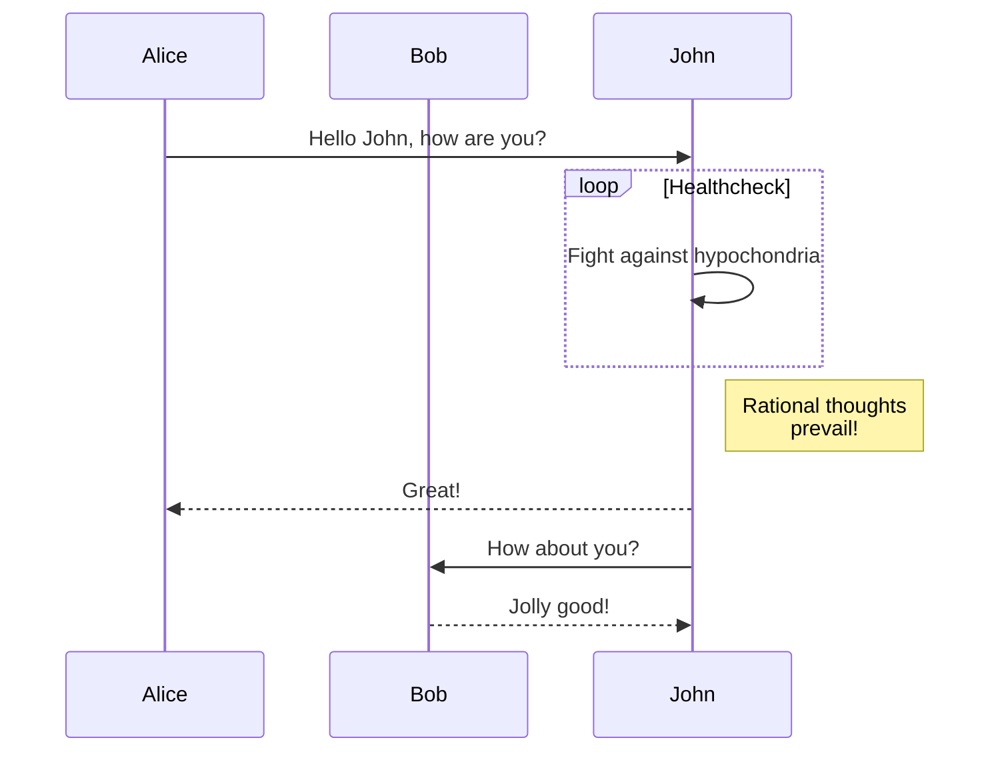
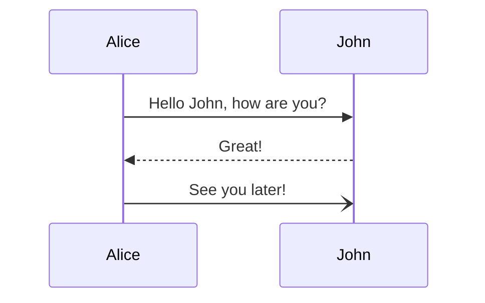
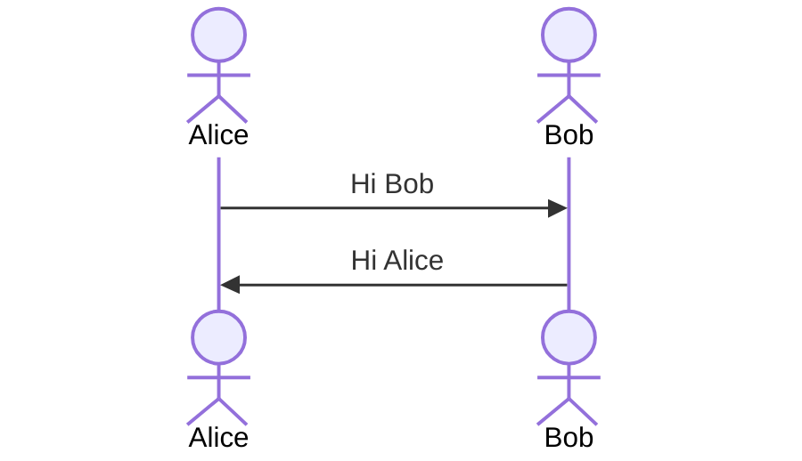
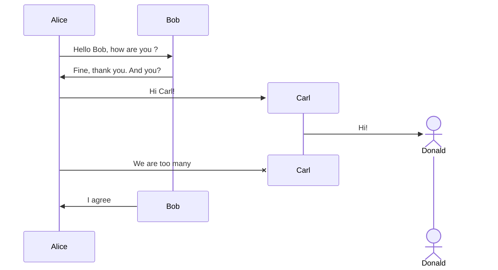
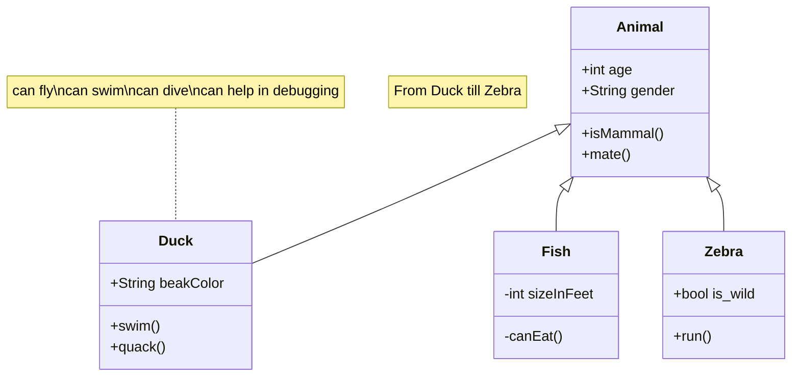

## Markdown image format

## HTML image format modified

### Frame

<Frame>
  
</Frame>

### Frame with caption

<Frame caption="Caption Text">
  
</Frame>

### Glass frame

<Frame type="glass">
  
</Frame>

